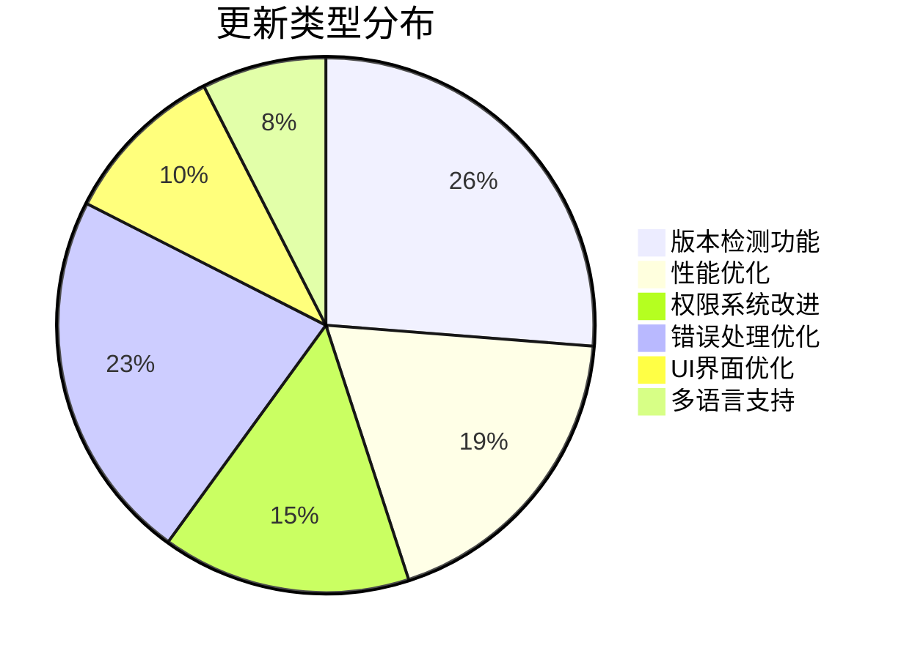
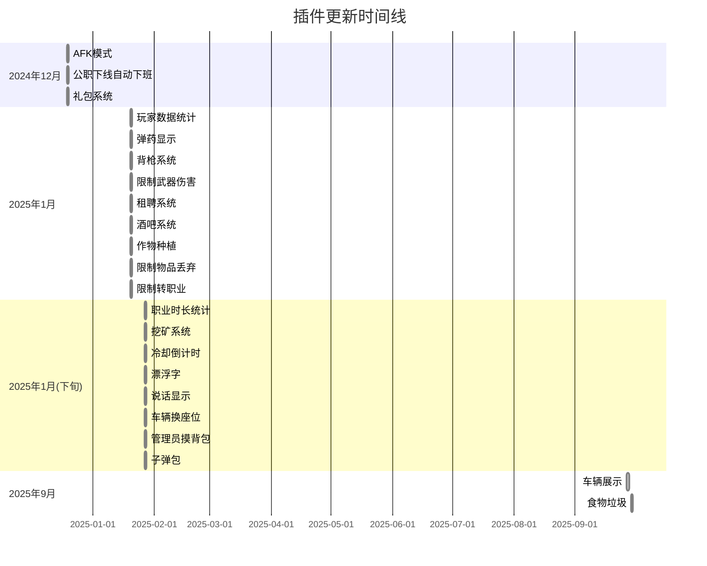

# 📋 FiveM 插件版本记录汇总
<!-- markdownlint-disable MD033 MD051 MD022 MD032 MD026 MD036 -->

---

## 📚 目录 

- [📊 版本统计概览](#stats)
- [🔄 更新趋势分析](#trends)
- [📋 详细版本记录](#details)
  - [👥 玩家管理类](#mgmt)
  - [🔫 武器与战斗类](#combat)
  - [💰 经济与交易类](#economy)
  - [🎮 游戏功能类](#gameplay)
  - [🛠️ 管理工具类](#admin)
  - [🚫 限制与规则类](#rules)
- [🔍 版本检测功能说明](#version-check)
- [📊 更新统计图表](#charts)
- [🎯 更新重点总结](#summary)
- [📞 技术支持](#support)

---

## 📊 版本统计概览 

| 统计项目 | 数量 | 说明 |
|---------|------|------|
| **总插件数量** | 22 | 包含所有功能插件 |
| **已更新插件** | 21 | 除调度插件外全部更新 |
| **版本检测功能** | 21 | 新增版本检测系统 |
| **最新版本日期** | 2025年1月 | 大部分插件最新更新 |

---

## 🔄 更新趋势分析 

### 📈 主要更新内容

1. **🔍 版本检测功能** - 21个插件新增
2. **⚡ 性能优化** - 多个插件优化
3. **🛡️ 权限系统改进** - 多个插件增强
4. **🐛 错误处理优化** - 多个插件改进
5. **🌍 多语言支持** - 部分插件新增

### 📅 更新时间分布

- **2025年1月**: 18个插件更新
- **2024年12月**: 2个插件更新  
- **2025年9月**: 1个插件更新

---

## 📋 详细版本记录 

### 👥 玩家管理类

#### 🕐 AFK模式 (Idle_idle_rewards)
- [打开文件](./Idle_idle_rewards.lua)
- **版本**: v1.4.0
- **发布日期**: 2024-12-19
- **主要更新**:
  - ✅ 添加版本检测功能
  - ✅ 优化防刷机制
  - ✅ 改进内存管理
  - ✅ 增强错误处理
  - ✅ 支持多挂机点和多奖励类型

#### 👮 公职下线自动下班 (Offline-off-duty)
- [打开文件](./Offline-off-duty.lua)
- **版本**: v2.0.0
- **发布日期**: 2024-12-19
- **主要更新**:
  - ✅ 新增版本检测功能
  - ✅ 新增完善的日志系统，支持不同日志级别
  - ✅ 新增白名单/黑名单支持
  - ✅ 新增自定义下班职业名称
  - ✅ 新增延迟下班功能
  - ✅ 新增高级配置选项
  - ✅ 完善错误处理
  - ✅ 性能优化
  - ✅ 向后兼容旧配置

#### 📊 玩家数据统计 (Player_stats)
- [打开文件](./Player_stats.lua)
- **版本**: v1.0.0
- **发布日期**: 2025-01-20
- **主要更新**:
  - ✅ 基于ESX框架的玩家数据统计系统
  - ✅ 支持游戏时长、等级、邀请奖励系统
  - ✅ 集成ox_lib图形界面菜单
  - ✅ 添加月度排行榜重置功能
  - ✅ 支持邀请码验证防刷系统
  - ✅ 优化性能，减少数据库查询

#### ⏰ 职业时长统计 (Duration_statistics)
- [打开文件](./Duration_statistics.lua)
- **版本**: v1.1.1
- **发布日期**: 2025-01-27
- **主要更新**:
  - ✅ 添加版本检测功能
  - ✅ 优化职业标签加载机制
  - ✅ 改进职位等级显示逻辑
  - ✅ 修复off_前缀处理问题

---

### 🔫 武器与战斗类 

#### 📦 子弹包 (zidanbao)
- [打开文件](./zidanbao.lua)
- **版本**: v1.0.0
- **发布日期**: 2025-01-27
- **主要更新**:
  - ✅ 初始版本发布
  - ✅ 添加子弹包使用功能
  - ✅ 支持ESX框架
  - ✅ 添加版本检测功能

#### 🔢 弹药显示 (jiu_toggleammo)
- [打开文件](./jiu_toggleammo.lua)
- **版本**: v2.0.0
- **发布日期**: 2025-01-20
- **主要更新**:
  - ✅ 添加版本检测功能
  - ✅ 优化武器缓存系统
  - ✅ 改进错误处理机制
  - ✅ 增强性能监控
  - ✅ 支持多语言界面
  - ✅ 修复已知问题

#### 🔫 背枪 (Carrying_weapon)
- [打开文件](./Carrying_weapon.lua)
- **版本**: v1.1.0
- **发布日期**: 2025-01-20
- **主要更新**:
  - ✅ 添加版本检测功能
  - ✅ 优化武器位置调整系统
  - ✅ 改进UI界面交互体验
  - ✅ 修复已知bug并提升稳定性

#### ⚔️ 限制武器伤害和伤害显示 (Wea_damage_recoil)
- [打开文件](./Wea_damage_recoil.lua)
- **版本**: v1.2.0
- **发布日期**: 2025-01-20
- **主要更新**:
  - ✅ 集成 ox_lib 图形界面菜单
  - ✅ 添加武器名称自动获取功能
  - ✅ 改进权限系统，支持ESX管理员和自定义标识符
  - ✅ 优化性能，减少日志输出
  - ✅ 添加版本检查系统
  - ✅ 增强权限管理

---

### 💰 经济与交易类 

#### 🎁 礼包系统 (Bundle_system)
- [打开文件](./Bundle_system.lua)
- **版本**: v1.0.0
- **发布日期**: 2024-12-19
- **主要更新**:
  - ✅ 支持 ESX 和 QBCore 框架
  - ✅ 包含时间限制、职业要求、物品组等功能
  - ✅ 支持一次性领取和重复领取
  - ✅ 集成版本检测功能

#### 🚗 租聘系统 (es-rentacar)
- [打开文件](./es-rentacar.lua)
- **版本**: v1.0.0
- **发布日期**: 2025-01-20
- **主要更新**:
  - ✅ 初始版本发布
  - ✅ 支持车辆租赁功能
  - ✅ 集成ESX框架
  - ✅ 支持多租车点配置

#### 🍺 酒吧系统 (Bar_system)
- [打开文件](./Bar_system.lua)
- **版本**: v1.2.0
- **发布日期**: 2025-01-20
- **主要更新**:
  - ✅ 添加版本检测功能
  - ✅ 优化NPC生成系统
  - ✅ 改进音乐控制功能
  - ✅ 增强便携式音响系统
  - ✅ 修复已知问题并提升稳定性

---

### 🎮 游戏功能类 

#### 🌱 作物种植与采摘 (jiu_Plantingharvesting)
- [打开文件](./jiu_Plantingharvesting.lua)
- **版本**: v1.0.0
- **发布日期**: 2025-01-20
- **主要更新**:
  - ✅ 初始版本发布
  - ✅ 支持作物种植与采摘功能
  - ✅ 集成挖矿系统
  - ✅ 支持ESX框架

#### ⛏️ 挖矿 (jiu_mining)
- [打开文件](./jiu_mining.lua)
- **版本**: v1.0.0
- **发布日期**: 2025-01-27
- **主要更新**:
  - ✅ 集成ox_lib图形界面菜单
  - ✅ 添加版本检测功能
  - ✅ 改进安全系统，防止刷物品
  - ✅ 优化挖矿概率计算
  - ✅ 添加管理员命令支持

#### ⏱️ 冷却倒计时 (cooldown)
- [打开文件](./cooldown.lua)
- **版本**: v1.0.0
- **发布日期**: 2025-01-27
- **主要更新**:
  - ✅ 初始版本发布
  - ✅ 支持管理员和警察启动冷却倒计时
  - ✅ 支持自定义冷却时间
  - ✅ 支持提前结束冷却功能
  - ✅ 添加版本检测功能

#### 💬 漂浮字 (Floating_word)
- [打开文件](./Floating_word.lua)
- **版本**: v1.0.0
- **发布日期**: 2025-01-27
- **主要更新**:
  - ✅ 初始版本发布
  - ✅ 支持创建、编辑、删除浮动文本
  - ✅ 集成ox_lib图形界面菜单
  - ✅ 支持权限管理系统
  - ✅ 添加版本检测功能

#### 🗣️ 说话显示 (ajiu_proximity)
- [打开文件](./ajiu_proximity.lua)
- **版本**: v1.0.5
- **发布日期**: 2025-01-27
- **主要更新**:
  - ✅ 添加版本检测功能
  - ✅ 优化语音提示显示效果
  - ✅ 改进玩家名称获取机制
  - ✅ 增强权限管理系统

#### 🚗 车辆换座位 (az_seatswitch)
- [打开文件](./az_seatswitch.lua)
- **版本**: v2.0.0
- **发布日期**: 2025-01-27
- **主要更新**:
  - ✅ 添加版本检测功能
  - ✅ 优化日志系统，支持日志轮转
  - ✅ 改进权限系统，支持ESX管理员和自定义标识符
  - ✅ 增强错误处理和调试信息
  - ✅ 支持多语言界面

#### 🏪 车辆展示 (vehicle_showroom)
- [打开文件](./vehicle_showroom.lua)
- **版本**: v1.1.1
- **发布日期**: 2025-09-27
- **主要更新**:
  - ✅ 重大更新 - 车辆重复生成问题修复
  - ✅ 新增全局车辆跟踪系统，防止多玩家上线时重复生成车辆
  - ✅ 服务端和客户端双重存在性检查机制
  - ✅ 车辆生成冷却时间，避免短时间内重复生成
  - ✅ 自动清理过期车辆跟踪记录，防止内存泄漏
  - ✅ 新增/vehicletracktest测试命令
  - ✅ 可配置的车辆跟踪系统参数
  - ✅ 完全解决车辆重复生成问题

---

### 🛠️ 管理工具类 

#### 🎒 管理员摸背包 (administrator_touches_backpack)
- [打开文件](./administrator_touches_backpack.lua)
- **版本**: v1.1.0
- **发布日期**: 2025-01-27
- **主要更新**:
  - ✅ 添加版本检测功能
  - ✅ 优化权限系统，支持ESX管理员组
  - ✅ 改进背包锁定机制，防止重复检查
  - ✅ 添加手动解锁命令和检查列表功能
  - ✅ 增强错误处理和调试信息

#### 📡 调度插件 (cd_dispatch)
- 文件未包含在仓库中，暂无可打开的文件
- **版本**: 未更新
- **说明**: 此插件未进行版本检测功能更新

#### 📤 服务器数据发送 (Data_Transfer)
- 文件未包含在仓库中，暂无可打开的文件
- **版本**: 未更新
- **说明**: 此插件未进行版本检测功能更新

---

### 🚫 限制与规则类 

#### 🚫 限制物品丢弃 (Restrict_item_discarding)
- [打开文件](./Restrict_item_discarding.lua)
- **版本**: v1.2.0
- **发布日期**: 2025-01-20
- **主要更新**:
  - ✅ 添加版本检测功能
  - ✅ 优化物品限制逻辑
  - ✅ 改进管理员权限系统
  - ✅ 增强错误处理和日志输出

#### 👔 限制转职业 (job_change_history)
- [打开文件](./job_change_history.lua)
- **版本**: v1.0.0
- **发布日期**: 2025-01-20
- **主要更新**:
  - ✅ 初始版本发布
  - ✅ 实现职业转换限制功能
  - ✅ 支持每周转职一次限制
  - ✅ 添加管理员命令和玩家查询功能
  - ✅ 集成版本检测系统

#### 🗑️ 食物垃圾 (Food_waste)
- [打开文件](./Food_waste.lua)
- **版本**: v1.1.0
- **发布日期**: 2025-09-29
- **主要更新**:
  - ✅ 添加版本检测功能
  - ✅ 实现Config.Debug调试模式
  - ✅ 优化错误处理和参数验证
  - ✅ 添加面包和酸菜鱼食物配置
  - ✅ 改进配置验证函数
  - ✅ 移除不必要的依赖

---

## 🔍 版本检测功能说明 

### 📋 功能概述

版本检测功能是本次更新的核心特性，为所有插件提供了统一的版本管理机制：

#### ✨ 主要特性

- **🔍 自动版本检查**: 启动时自动检查最新版本
- **📊 版本对比**: 显示当前版本与最新版本对比
- **🔄 更新提示**: 发现新版本时自动提示
- **📝 更新日志**: 显示详细的更新内容
- **🌐 多格式支持**: 支持Lua和JSON格式的版本文件

#### 🛠️ 技术实现

- **GitHub集成**: 从GitHub仓库获取版本信息
- **本地缓存**: 缓存版本信息提高性能
- **错误处理**: 网络异常时的降级处理
- **配置灵活**: 可配置检查频率和URL

#### 📈 使用效果

- **用户体验**: 用户及时了解插件更新
- **维护效率**: 管理员快速了解插件状态
- **版本管理**: 统一的版本管理机制
- **问题追踪**: 便于问题定位和解决

---

## 📊 更新统计图表 

### 🎯 更新类型分布

### 📅 更新时间线

---

## 🎯 更新重点总结 

### 🚀 核心改进

1. **统一版本管理**: 所有插件集成版本检测功能
2. **性能优化**: 多个插件进行性能提升
3. **用户体验**: UI界面和交互体验改进
4. **稳定性提升**: 错误处理和异常情况优化
5. **功能扩展**: 新增多项实用功能

### 🔧 技术升级

1. **ox_lib集成**: 多个插件采用现代化UI库
2. **权限系统**: 统一的权限管理机制
3. **多语言支持**: 国际化功能扩展
4. **日志系统**: 完善的调试和监控功能
5. **配置优化**: 更灵活的配置选项

### 📈 质量提升

1. **代码质量**: 代码结构和可维护性改进
2. **文档完善**: 详细的说明文档和更新日志
3. **测试覆盖**: 更好的错误处理和边界情况
4. **兼容性**: 与主流框架的兼容性优化
5. **安全性**: 防刷机制和安全措施加强

---

## 📞 技术支持 

### 🆘 获取帮助

- **QQ1**: 286140338
- **QQ2**: 3157340884

### 📋 问题反馈

如遇到问题，请提供以下信息：
- 插件名称和版本号
- 错误信息截图
- 服务器环境信息
- 复现步骤

---

### ⭐ 如果这些插件对您有帮助，请给个星标支持！

---

*最后更新：2025年1月 | 版本：v1.0.0*

